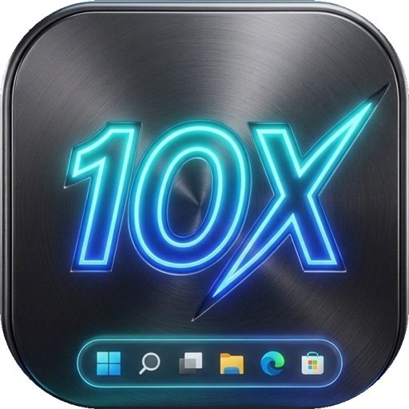

# ⚡ 10xbar — Windows Taskbar Folders & Decluttering Suite

<p align="center">
  
  <br>
  <em>Organize, declutter, and accelerate your Windows 10 & 11 taskbar with custom folder flyouts.</em>
</p>

---

## ✨ Features

- 📁 **Taskbar Folders**: Group your everyday applications into clean categories (e.g., *Dev Tools*, *Productivity*, *Media*, *Gaming*).
- 🪟 **Windows 11 Fluent Flyout**: Clicking a pinned folder icon on the taskbar instantly opens a sleek, dark-themed flyout popup docked right above your taskbar icon.
- 🎨 **Adaptive Themes & Custom Icons**: Automatically generates high-res `.ico` and `.png` icons with custom accent colors and badges.
- ⚡ **Drag & Drop Support**: Drag `.exe` or `.lnk` shortcuts directly from your desktop or File Explorer into any folder group.
- 🔍 **Automatic High-Res Icon Extraction**: Automatically extracts 32x32 and 48x48 icons from executables and resolves Windows shortcuts.
- 🚀 **1-Click Launch & Auto-Dismiss**: Clicking any application launches it immediately and closes the flyout. Clicking outside or pressing `Escape` dismisses the popup smoothly.
- 📌 **One-Click Pin to Taskbar**: Generates native `.lnk` shortcuts ready to pin directly to the Windows Taskbar.

---

## 🚀 Quick Start

### 1. Launch the Configurator Dashboard
Run the application to manage your folders:
```powershell
C:\Users\milad\.gemini\antigravity\scratch\10xbar\publish\TenXBar.exe
```

### 2. Pin a Folder to Your Taskbar
1. Inside the 10xbar dashboard, select a folder (e.g. **Dev Tools** or **Productivity**).
2. Click the **"📌 Pin to Taskbar"** button.
3. File Explorer will open with your folder shortcut selected.
4. **Right-click** the shortcut file (`.lnk`) and select **"Pin to taskbar"** (or *Show more options* -> *Pin to taskbar* on Windows 11).
5. Done! You now have a folder on your Windows Taskbar!

### 3. Open Any Folder via Taskbar
Click the newly pinned icon on your taskbar. The **10xbar Flyout** will appear right at your cursor/taskbar position.

---

## 🛠️ CLI Usage

| Command | Description |
|---|---|
| `TenXBar.exe` | Opens the 10xbar Management Dashboard |
| `TenXBar.exe launch "<GroupId or Name>"` | Opens the flyout popup for the specified group |
| `TenXBar.exe generate-shortcuts` | Generates `.lnk` shortcuts for all configured groups |

---

## 📂 Storage Locations

- **Configuration File**: `%APPDATA%\10xbar\groups.json`
- **Extracted Icons**: `%APPDATA%\10xbar\icons\`
- **Taskbar Shortcuts**: `%APPDATA%\10xbar\shortcuts\`

---

## 🧪 Build & Tests

Built with .NET 8 SDK:
```powershell
# Run Unit Tests
dotnet test Tests\TenXBar.Tests.csproj

# Build Release
dotnet publish TenXBar.csproj -c Release -r win-x64 --self-contained false -o publish
```
